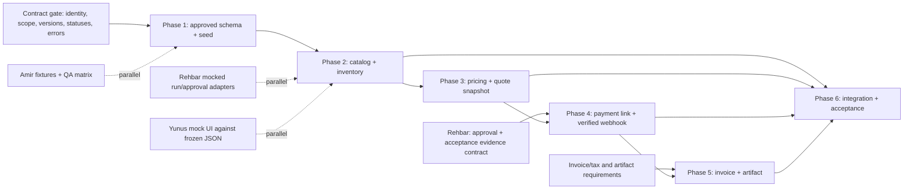

# StockAware backend implementation plan

This plan operationalizes [the StockAware build plan](build-plan.md) and the supplied StockAware master context. It is a dependency map for Fareed's backend work, not approval of unresolved business rules. The team's recorded contract decisions must be added before dependent migrations or APIs are implemented. Rehbar owns workflow, WhatsApp ingress, approval capture, and orchestration; Fareed owns commercial truth; Yunus owns Next.js UI; Amir owns fixtures, QA, alerts, and demo support.

## A. Current repository state

| Area | Observed implementation | Evidence |
| --- | --- | --- |
| FastAPI | Installable Python 3.12 package; app factory, CORS configuration, `/health/live` and `/health/ready`. No commercial routers. | `server/pyproject.toml`, `server/app/main.py`, `server/app/api/router.py` |
| PostgreSQL | Local PostgreSQL 17 Compose service with persistent volume; SQLAlchemy engine uses psycopg and `pool_pre_ping`; readiness executes `SELECT 1`. | `compose.yaml`, `server/app/db/session.py`, `server/app/api/routes/health.py` |
| Alembic | Environment wired to `Base.metadata`; one empty baseline revision. The live local database has only `public.alembic_version`. | `server/migrations/env.py`, `server/migrations/versions/0001_baseline.py` |
| Configuration | `.env.example` describes local database, port, CORS, and future Razorpay keys. Runtime rejects the placeholder database password. Real `.env` is ignored by Git. | `.env.example`, `.gitignore`, `server/app/core/config.py` |
| Docker | Compose has DB health gate, one-shot migration service, API health gate; local API and DB ports bind to loopback. Backend image runs as a non-root user. | `compose.yaml`, `server/Dockerfile` |
| Domain packages | Catalog, inventory, pricing, payments, and invoices contain only `__init__.py` package markers. SQLAlchemy `Base.metadata` is empty. | `server/app/modules/`, `server/app/db/base.py` |
| Tests and checks | Two foundation tests: liveness and database URL escaping. Ruff and pre-commit are configured. There is no PostgreSQL integration test or commercial test. | `server/tests/`, `.pre-commit-config.yaml` |
| Frontend | Next.js starter page and styles, with no StockAware screens or API client. No Next.js business API routes. | `client/app/`, `client/package.json` |

The local containers were healthy during inspection and `/health/ready` returned `{"status":"ok","database":"ok"}` on port 8001. This proves connectivity only; it does not prove any commercial workflow. The master context sketches a future AWS/DynamoDB architecture, while the current build plan and team choice use local PostgreSQL. An AWS persistence target remains a separate architecture decision; this plan assumes PostgreSQL only for the current build.

## B. Missing functionality

- No business/customer, product, alias, substitute, inventory, pricing rule, quote, payment, provider-event, invoice, or idempotency persistence exists.
- No approved seed products or repeatable seed command exists.
- No catalog match, stock check, pricing/quote, payment-link, payment-webhook, invoice, or commercial read endpoint exists.
- No Razorpay client, webhook signature verifier, payment state transition, reconciliation, or provider test fixture exists.
- No invoice numbering, PDF generation, artifact storage interface, or resend path exists.
- No authentication/authorization or business-scope enforcement exists for future commercial routes. CORS alone does not provide either.
- No shared request/response contract or executable end-to-end integration tests exist for Rehbar and Yunus.
- Rehbar's run, approval, WhatsApp, and audit services and Yunus's UI are outside Fareed's implementation boundary and are not present in this repository yet.

## C. Dependency graph



The graph is a logical dependency, not a requirement that everyone wait. Amir can prepare fixtures and QA cases immediately. Rehbar can orchestrate mocked commercial responses, and Yunus can build UI against frozen example JSON. Fareed can unit-test domain services against agreed fixtures before WhatsApp is connected.

## D. Proposed implementation sequence

### Phase 0 — Contract gate before Phase 1

Record answers in a versioned contract document and example payloads. Resolve the seven decisions in section E, plus status names and which service owns each state. Do not infer approval from a boolean or payment success from a buyer message. Agree on what data the frontend may receive. This gate is complete when Rehbar, Fareed, and Yunus can each implement against the same example RFQ, quote, payment, invoice, and error objects.

### Phase 1 — Database, schema, seed

**Prerequisites:** business scope, stable IDs, quote-version semantics, and the minimum entity relationships that the team has approved. Obtain Amir's seed list and clearly label any demo-only values.

1. Model only approved entities and relationships, using SQLAlchemy 2 conventions and explicit database constraints. Choose money and quantity representations before the first commercial migration. Decide which records are snapshots and which are mutable truth.
2. Write and review Alembic revision(s). Include uniqueness/index requirements for SKU scope, provider event IDs, idempotency keys, and invoice issuance when those entities are approved. Do not treat autogenerate output as reviewed SQL.
3. Add a rerunnable seed command for the agreed electrical/hardware products, aliases, stock, and policy fixtures. Keep fixture provenance clear and do not embed real credentials.
4. Add migration/seed tests against an isolated PostgreSQL test database; do not run destructive migration tests against the working local volume.

**Exit evidence:** fresh test database migrates to head; approved seed loads twice without duplicates; constraints reject the intended duplicates. The exact table list and tenant-key placement stay open until Phase 0 decisions are recorded.

### Phase 2 — Catalog and inventory

**Prerequisites:** approved product identity, alias normalization rules, unit/pack model, stock quantity semantics, and Phase 1 catalog/stock persistence.

1. Add thin `GET /products`, `POST /catalog/match`, and `POST /inventory/check` routes, with request/response schemas and service/repository layers.
2. Return explicit matched, ambiguous, and not-found results; preserve candidate SKU IDs and reason codes. A low-confidence result must require clarification, never an invented SKU.
3. Read stock and return availability, low-stock signals, and agreed substitutes. Quote preparation must not hard-deduct inventory. Reservation/deduction belongs to a later agreed workflow rule.
4. Test alias collisions, quantity/unit conversion, out-of-stock, low-stock threshold, and tenant isolation where applicable.

**Exit evidence:** Rehbar can pass a normalized RFQ and get deterministic product and stock outcomes; Yunus can render the safe product/stock fields.

### Phase 3 — Pricing and quotes

**Prerequisites:** Phase 2 SKU and stock outcomes, approved price/cost visibility, discount/margin policy, tax inputs, quote expiry, approval exceptions, and quote-version ownership.

1. Implement pure, reproducible calculations before HTTP transport. Use integer minor units or decimal arithmetic according to the agreed money contract; never binary floats.
2. Add `POST /pricing/quote` and persistence for an immutable line, price, tax, and policy snapshot tied to `run_id` and quote version. Define how a revised quote supersedes an older one.
3. Return subtotal, tax, total, expiry, `approval_required`, and structured reasons. Rehbar captures approval; Fareed validates its exact quote/version binding before commercial mutations.
4. Test rounding, discounts, margin thresholds, tax contexts, concurrent quote revisions, and deterministic recalculation from saved inputs.

**Exit evidence:** the same saved quote snapshot reproduces its totals after catalog prices change, and exceptions cannot silently become accepted prices.

### Phase 4 — Payments and Razorpay

**Prerequisites:** an accepted, unexpired quote; Rehbar's acceptance and approval evidence contract; exact amount/currency; Razorpay credentials and agreed provider event semantics.

1. Implement `POST /payments/create-link` and `GET /payments/{id}` with a local payment intent/record and request idempotency. The provider call is outside a PostgreSQL transaction: design a recoverable state for a timeout or crash between local persistence and provider response.
2. Implement `POST /payments/webhook`: verify signature on the raw body before trusting parsed data, bind provider IDs and amount/currency to the local payment, and record unique provider event IDs.
3. Apply a single legal payment state transition transactionally. A duplicate verified event returns a stable result without repeating downstream work. Treat out-of-order or conflicting provider events explicitly.
4. Define a durable handoff to Rehbar and invoice processing after commit. The mechanism can be simple for MVP, but it cannot rely solely on an in-process callback that disappears on restart.

**Exit evidence:** rejected signatures and amount mismatches never mark a payment paid; duplicate/replayed events cannot create a second paid transition or invoice trigger. Buyer text does not affect payment state.

### Phase 5 — Invoices and artifacts

**Prerequisites:** verified paid record, linked quote snapshot, invoice type/GST requirements, seller and buyer identity fields, numbering policy, and artifact access rules.

1. Implement `POST /invoice/generate` and `GET /invoices/{id}`. Enforce one issuance per eligible payment with a PostgreSQL uniqueness constraint and transaction.
2. Create the invoice from the frozen quote/payment data, not mutable product or pricing records. Numbering and tax presentation must follow the business/accounting decision.
3. Generate PDF bytes through a storage interface. Use a local artifact store for MVP; save the stable storage reference in PostgreSQL and provide a path to later S3 adoption.
4. Make a crash between DB issuance and PDF storage recoverable without issuing a new invoice number. Resend reads the existing invoice/artifact.

**Exit evidence:** unpaid payments are rejected, valid paid payments issue one invoice, retries return that invoice, and the referenced artifact is retrievable.

### Phase 6 — Integration and acceptance

**Prerequisites:** stable contracts and phase-level tests; Rehbar's workflow callbacks and Yunus's consuming screens can remain mocked until their modules are ready.

1. Run contract tests for every cross-owner payload and state transition. Keep examples in version control so mock and real implementations agree.
2. Run PostgreSQL-backed tests for concurrent requests, duplicate webhook delivery, quote revision/approval races, payment amount mismatch, invoice idempotency, and artifact retry.
3. Exercise one complete scenario: normalized RFQ → match → stock → quote → exact-version approval/acceptance → payment link → verified provider event → invoice → run/UI status. Include failure and retry paths.
4. Re-run lint, unit tests, integration tests, OpenAPI contract checks, and secret checks in CI before demo handoff.

**Exit evidence:** the acceptance outcomes in the master context are demonstrable, with an auditable run timeline owned by Rehbar and commercial IDs/states supplied by Fareed.

## E. Contract decisions required before dependent work

| Decision to freeze | Owner(s) of answer | Blocks | Minimum answer needed |
| --- | --- | --- | --- |
| `run_id` | Rehbar + Fareed | Quote linkage and all later records | Format, uniqueness scope, generation owner, and whether it can be retried/reused. |
| Buyer/customer identity | Rehbar + Fareed + Yunus | Price tier, quote, payment, invoice | Stable customer key, display/legal identity, phone linkage, and which fields are verified. |
| Quote version | Rehbar + Fareed | Revisions, approval, payment | Version creation owner; immutable fields; supersession and stale-version rejection. |
| Quote acceptance evidence | Rehbar + Fareed | Payment link | Source event, actor, timestamp, quote ID/version, expiry, and retry behavior. |
| Approval identity | Rehbar + Fareed | Policy exception/payment | Approval/action ID, actor authorization, exact run/quote/version binding, expiry, revocation, and duplicate action handling. |
| Error envelope | Rehbar + Fareed + Yunus | All APIs and UI states | JSON shape, stable code vocabulary, correlation/run ID, validation errors, and HTTP mapping. |
| Business scope | Team | Initial schema, every query, access control | Single-business-only data versus tenant key on all commercial records; authorized actor mapping. |

Additional decisions that must precede their respective phases: unit/pack conversion and substitute eligibility (Phase 2); pricing, rounding, discount, margin, GST, and quote expiry rules (Phase 3); exact Razorpay event/state criteria and retry/reconciliation policy (Phase 4); invoice type, numbering, tax fields, PDF access, and retention (Phase 5); local PostgreSQL-to-AWS persistence target (deployment planning). The current build plan lists possibilities for these; none is silently promoted to policy here.

## F. Risks and blockers

| Risk | Failure mode | Required design/control |
| --- | --- | --- |
| Quote and approval race | Approval applies to an old quote after repricing or expiry. | Bind approval to exact run/action/quote version; reject stale version atomically. Rehbar owns approval capture. |
| Stock race | Two quotes read the same quantity or inventory changes before payment. | Define reservation/deduction trigger with Rehbar; use transactional stock update or version check at that trigger. Do not deduct during quote lookup. |
| Money precision | Float/rounding drift changes quote, link, or invoice amount. | Freeze currency/minor-unit contract and rounding policy; compare exact stored totals at every stage. |
| Mutable source data | Catalog price, cost, tax, or SKU alias changes after quoting. | Store quote item and policy snapshots with provenance/version; never reprice a paid invoice from live catalog. |
| Duplicate mutation | Retries create multiple quotes, links, or invoices. | Scope idempotency keys, request hashes, database uniqueness, and deterministic retry responses. |
| External call boundary | Razorpay link exists but local DB update fails, or vice versa. | Persistent intent, reconciliation/retry path, provider idempotency where supported, no long DB transaction around network call. |
| Webhook replay/order | Replayed or delayed provider event regresses or double-advances payment. | Verify raw-body signature, unique event ID, allowed state transitions, exact ID/amount/currency binding, and transaction around event+state. |
| Invoice uniqueness/artifact gap | Two workers issue numbers or DB points to missing PDF. | DB uniqueness/locking, idempotent artifact operation, recoverable pending state, existence check before resend. |
| Unauthorized data access | Future commercial routes expose cost, policy, or another business's records. | Decide identity/business scope, authenticate actor, authorize each query/mutation; do not treat CORS as authorization. |
| Contract drift | Rehbar, Fareed, and Yunus use different statuses or fields. | Freeze examples and OpenAPI/schema tests; version contract changes and review cross-owner impact. |

The present blockers for commercial implementation are the unrecorded decisions in section E, missing real fixtures from Amir, and missing Razorpay/invoice requirements. These do not block independent service design, test harness work, or mock-based UI/orchestration work.

## G. Expected Phase 1 files/modules

These paths are a file map, not permission to settle the schema prematurely. Create only files required by the approved contracts; one or more migrations may be preferable to a single large revision.

| Existing file to update | Reason |
| --- | --- |
| `server/app/db/base.py` | Import approved model modules so Alembic sees their metadata. |
| `server/migrations/env.py` | Change only if approved model registration or migration configuration requires it. |
| `server/pyproject.toml` | Add only dependencies required by chosen seed/test implementation. |

| New file/module expected | Purpose; conditional on contract gate |
| --- | --- |
| `server/app/modules/catalog/models.py` | Approved product/alias/substitute and business-scope persistence. |
| `server/app/modules/inventory/models.py` | Approved stock representation. |
| `server/app/modules/pricing/models.py` | Approved rule/quote/quote-item snapshot persistence. |
| `server/app/modules/payments/models.py` | Approved payment/provider-event/idempotency persistence. |
| `server/app/modules/invoices/models.py` | Approved invoice identity/artifact reference. |
| `server/migrations/versions/<revision>_commercial_schema.py` | Reviewed DDL for only the approved entities and constraints. |
| `server/app/seed.py` or `server/app/seeds/` | Repeatable, clearly demo-labeled seed loader. |
| `server/tests/test_schema.py` and `server/tests/test_seed.py` | Isolated PostgreSQL migration and rerun/constraint checks. |
| `docs/contracts.md` | Recorded decisions and canonical example payloads shared with Rehbar and Yunus. |

No Phase 1 change is expected in `client/`, Rehbar's workflow/WhatsApp code, or Amir's alert content. If the team defers quote/payment/invoice table contracts, their model files and migrations move to their later phases; do not invent placeholders that constrain the interface.

## H. Safe verification commands

Run from the repository root. These commands inspect configuration or read state; they do not apply migrations, seed data, rebuild images, or remove volumes. Use the API port from local `.env` if different from 8000 (this machine currently uses 8001).

```bash
git status --short
git diff --check
docker compose config --quiet
docker compose ps
curl -sS http://127.0.0.1:8001/health/ready
curl -sS http://127.0.0.1:8001/openapi.json
docker compose exec -T db sh -c 'psql -U "$POSTGRES_USER" -d "$POSTGRES_DB" -Atc "select version_num from alembic_version"'
server/.venv/bin/ruff check --no-cache server
server/.venv/bin/ruff format --check server
PYTHONDONTWRITEBYTECODE=1 server/.venv/bin/pytest -p no:cacheprovider server/tests
```

The current test suite does not use PostgreSQL. A green result confirms the foundation only. For Phase 1 and later, add isolated database tests before claiming commercial correctness.
