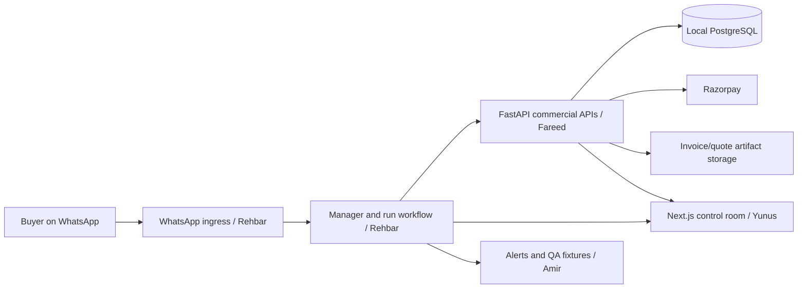

# StockAware build plan: Fareed backend and team boundaries

This is the working implementation guide for the current repository. The product is a WhatsApp-first quote-to-cash system for electrical and hardware wholesalers. The buyer sends an RFQ, receives a quote, accepts it, pays through Razorpay, and receives an invoice. The owner sees approvals, exceptions, and an audit trail in the web control room.

## 1. What exists today

The setup phase provides:

- `server/`: installable FastAPI app, PostgreSQL connection configuration, Alembic, health endpoints, and domain package locations.
- `compose.yaml`: local PostgreSQL with a named data volume, a one-shot migration service, and FastAPI. The API waits for a healthy database and a successful migration.
- `.env.example`: local configuration template. Real `.env` files are ignored by Git and excluded from the Docker image.
- `.pre-commit-config.yaml`: formatting, syntax, private-key, and secret checks. Install hooks locally before committing.
- `client/`: the existing Next.js starter. The actual product UI has not been built yet.

The baseline migration only records the migration history. It does **not** create product, stock, quote, payment, or invoice tables. No commercial API is implemented yet. This is deliberate: freeze field names and workflow ownership with the team before creating those tables.

## 2. Run the system locally

Prerequisites: Docker with Compose, Python 3.12 for local backend development, and Node.js for the Next.js app.

From the repository root:

```bash
cp .env.example .env
# Edit .env and replace POSTGRES_PASSWORD with a unique local password.
docker compose config
docker compose up --build -d
docker compose ps
```

Expected checks:

```bash
curl http://localhost:8000/health/live
curl http://localhost:8000/health/ready
```

Both should return HTTP 200. `/health/ready` runs a real `SELECT 1` against PostgreSQL. Open `http://localhost:8000/docs` for the FastAPI OpenAPI page. PostgreSQL listens on `127.0.0.1:5432` by default; FastAPI listens on `127.0.0.1:8000`. Change `POSTGRES_PORT` or `API_PORT` in `.env` if those host ports are in use. Both bindings are local to the machine.

Useful commands:

```bash
docker compose logs -f server
docker compose logs migrate
docker compose exec db psql -U stockaware -d stockaware
docker compose down
```

`docker compose down` preserves the named PostgreSQL volume. Changing `POSTGRES_PASSWORD` in `.env` after the database is initialized does not rotate the existing PostgreSQL role password; change it inside PostgreSQL or use a new volume with an intentional data migration. Never casually remove the volume.

For local Python tooling:

```bash
make install
make hooks
make lint
make test
server/.venv/bin/pre-commit run --all-files
```

For the frontend:

```bash
cd client
npm install
npm run dev
```

During local development, the frontend should call `http://localhost:8000`. The API CORS allowlist is set by `CORS_ORIGINS` in `.env`; use a JSON array such as `["http://localhost:3000"]`. Do not put Razorpay secrets or database credentials in `NEXT_PUBLIC_*` variables. If the frontend uses browser-side requests, only a public API base URL should be exposed there.

## 3. System design and responsibility boundary



Rehbar owns the run lifecycle, WhatsApp webhook, owner approval, accepted-quote trigger, and audit event orchestration. Fareed owns product truth, stock truth, quote arithmetic and policy, payment link creation, provider webhook verification, and invoice generation. Yunus owns the Next.js screens. Amir owns fixtures, alert/reminder content, QA scenarios, and demo support.

The FastAPI service can read a `run_id` from Rehbar. It should not independently advance Rehbar's workflow state. Return explicit business results that Rehbar can apply to the run. Agree on one source of truth for the quote's accepted state and approval record before implementing `/payments/create-link`.

## 4. Repository layout to grow into

```text
server/
  app/
    api/routes/health.py          # existing health routes
    core/config.py                # existing environment validation
    db/base.py                    # existing SQLAlchemy model registry
    db/session.py                 # existing PostgreSQL engine/session
    modules/
      catalog/                   # product, aliases, matching
      inventory/                 # stock, reservations, substitutes
      pricing/                   # rules, quotes, tax calculations
      payments/                  # Razorpay client and webhook handling
      invoices/                  # invoice numbering and artifacts
  migrations/versions/           # versioned PostgreSQL schema changes
  tests/                         # service and API tests
client/app/                      # Yunus's Next.js pages
docs/                            # architecture and contracts
```

Inside each backend domain, use `models.py` for database entities, `schemas.py` for validated requests and responses, `repository.py` for SQL queries, `service.py` for business decisions, and `router.py` for HTTP transport. Add a file only when the domain needs it. Keep calculation and policy rules outside route handlers. Import each new model module from `app/db/base.py` so Alembic can discover it.

### PostgreSQL choice

PostgreSQL is the local system of record for this build. Use PostgreSQL transactions and uniqueness constraints for quotes, payment events, invoice numbers, and idempotency records. Keep money as integer paise or `NUMERIC` with explicit decimal arithmetic; never use binary floating-point for quote or tax totals. Store timestamps as timezone-aware UTC values. Store PDF object keys/URLs in PostgreSQL; keep PDF bytes in local artifact storage for the demo and later in S3.

When moving to AWS, a managed PostgreSQL service such as RDS can replace the local Compose database without changing the application domain model. Move files to S3 and inject secrets through AWS Secrets Manager or another managed secret source. Run Alembic migrations as a controlled deployment step. The current Docker Compose migration service is for local development; do not run the same automatic migration pattern across multiple production API replicas.

## 5. Backend build order for Fareed

### Step 0 — Freeze contracts with the team

Agree with Rehbar on `run_id`, buyer/customer ID, approved action ID, quote version, quote acceptance evidence, and error response format. Agree with Yunus on the fields needed for quote, payment, and invoice screens. Ask Amir for sample catalog rows, RFQs, and failure cases. Put agreed examples in `docs/` and tests before implementing dependent endpoints.

Use UUIDs or stable business IDs internally, with separate human-readable numbers for quotes and invoices. Every mutation should carry an idempotency key or a unique provider event ID. Do not rely on a buyer's text saying “paid.”

### Step 1 — Create PostgreSQL schema and seed data

Create a new Alembic revision for the first real schema. Recommended entities:

| Entity | Minimum columns and rules |
| --- | --- |
| `businesses` | ID, legal/display name, GST details, currency; one demo business initially |
| `products` | ID, business ID, SKU unique within business, name, unit, pack size, cost, base price, GST rate, active flag |
| `product_aliases` | Product ID, normalized alias, business ID; constrain accidental duplicates |
| `product_substitutes` | Product and substitute IDs, rank, reason |
| `inventory` | Product ID, on-hand quantity, reserved quantity, reorder threshold, version |
| `pricing_rules` | Business/customer scope, margin floor, discount cap, effective dates |
| `quotes` | ID, run ID, version, status, currency, subtotal, tax, total, expiration, policy snapshot, approval reference |
| `quote_items` | Quote ID, product/SKU snapshot, quantity, unit, price, discount, tax rate, line totals |
| `payments` | Quote ID, exact amount/currency, provider link ID, provider payment ID, status, idempotency key |
| `payment_events` | Provider event ID unique, payment ID, verified timestamp, safe event metadata |
| `invoices` | Quote ID/payment ID unique where appropriate, invoice number unique, totals, artifact reference, generated timestamp |
| `idempotency_keys` | Scope + key unique, request hash, response reference, creation/expiry timestamps |

The schema is a proposal, not a frozen team contract. Decide whether `business_id` must be present on every table before onboarding more clients. Seed 8–15 electrical/hardware products with aliases, stock, costs, prices, GST rates, and substitutes. Make the seed script safe to rerun without duplicating rows.

Migration workflow from `server/`:

```bash
.venv/bin/alembic revision --autogenerate -m "add commercial tables"
.venv/bin/alembic upgrade head
```

Review generated migrations before applying them. Alembic autogenerate is a starting draft, especially for constraints, data migrations, and indexes. If using Docker instead of a local virtual environment, rebuild and run the migration service after a new revision is added.

### Step 2 — Catalog and stock APIs

Build `GET /products`, `POST /catalog/match`, and `POST /inventory/check`. Matching should return one of `MATCHED`, `AMBIGUOUS`, or `NOT_FOUND`, along with candidate SKU IDs and an explanation. Do not invent a SKU when names are unclear. Stock checks should distinguish available, insufficient, and out-of-stock quantities, plus low-stock and substitute suggestions. Quote preparation only reads stock. Define a separate reservation/deduction policy for accepted or paid orders with Rehbar.

### Step 3 — Pricing and quote API

Build `POST /pricing/quote`. Input includes `run_id`, identified SKUs, quantities, customer context, requested discount, and delivery/tax context. Store a price and policy snapshot so later recalculation is reproducible even if the catalog price changes. Output includes line totals, subtotal, tax, total, currency, expiry, approval-required flag, and reason codes. Treat a margin floor or discount cap breach as an approval decision, not silent price acceptance.

Confirm GST treatment with the business: intra-state versus inter-state tax and invoice requirements can change the output. Do not guess these from a product name. Keep tax calculation as a testable service function.

### Step 4 — Payment API and Razorpay callback

Build `POST /payments/create-link`, `POST /payments/webhook`, and `GET /payments/{id}`. Create a link only for a valid, unexpired, accepted quote with the required approval bound to its exact version and amount. Persist the provider link ID and local payment record before reporting success. Verify the Razorpay webhook signature against the raw request body, then verify quote/payment IDs, amount, currency, and event type. Store the provider event ID under a unique constraint so retries are safe. Return an idempotent success response for a verified duplicate event; do not issue a second invoice trigger.

`RAZORPAY_KEY_ID`, `RAZORPAY_KEY_SECRET`, and `RAZORPAY_WEBHOOK_SECRET` are **not** required by the current setup. Add them to local `.env` only when implementing payments. Never send them to Next.js, write them in docs, or log signed webhook payloads.

### Step 5 — Invoice API and artifact

Build `POST /invoice/generate` and `GET /invoices/{id}`. Require a verified paid state and the exact linked quote. Reserve invoice numbers in PostgreSQL and make `payment_id` unique for issuance so a repeated trigger returns the existing invoice. Persist an immutable line and tax snapshot. Generate a PDF, store it in a local artifact directory for the demo, and save only its storage reference in PostgreSQL. Design the storage interface so S3 can replace local files later. Provide a resend/read response that references the existing invoice instead of generating a new one.

### Step 6 — Integration and acceptance tests

Test catalog ambiguity, unit/pack mismatch, low stock, out of stock, discount cap, margin floor, quote expiry, duplicate link requests, invalid webhook signature, amount mismatch, duplicate webhook events, invoice-before-payment rejection, and invoice idempotency. Include at least one full happy-path fixture with a real PostgreSQL test database. Rehbar can integrate against the API before WhatsApp is fully connected by sending local JSON payloads.

## 6. Proposed HTTP contracts

The path names below are the team-facing paths. FastAPI will expose them directly from `server/`; they are not Next.js `app/api` routes. Use stable JSON field names and explicit error codes.

| Method/path | Primary request | Primary response | Owner |
| --- | --- | --- | --- |
| `GET /products` | Business/customer scope, paging | Product list, stock summary where permitted | Fareed |
| `POST /catalog/match` | `run_id`, requested name/unit/quantity | Match status, SKU candidates, confidence | Fareed |
| `POST /inventory/check` | `run_id`, SKU/quantity lines | Availability, substitutes, low-stock flags | Fareed |
| `POST /pricing/quote` | `run_id`, priced lines, discount context | Quote/version, totals, approval reasons | Fareed |
| `POST /payments/create-link` | Accepted quote ID/version, approval, idempotency key | Payment ID, status, URL, amount/expiry | Fareed |
| `POST /payments/webhook` | Raw Razorpay request/signature | Verified event receipt | Fareed |
| `POST /invoice/generate` | Verified payment ID, idempotency key | Invoice ID/number, totals, PDF reference | Fareed |
| `GET /payments/{id}` | Payment ID | Payment state safe for UI | Fareed |
| `GET /invoices/{id}` | Invoice ID | Invoice state/artifact reference | Fareed |
| `POST /webhook/whatsapp` | Meta webhook | Run intake result | Rehbar |
| `POST /admin/command` | Owner instruction/approval | Run action result | Rehbar |
| `GET /runs/{id}` | Run ID | Workflow status and links | Rehbar |
| `GET /runs/{id}/timeline` | Run ID | Auditable events | Rehbar |

Suggested error envelope: `{ "error": { "code": "QUOTE_EXPIRED", "message": "Quote has expired", "run_id": "RFQ-1042" } }`. Agree with Rehbar before implementing it globally. Use appropriate HTTP codes: 400 for invalid input, 401/403 for auth, 404 for missing records, 409 for stale versions/conflicts, and 422 for structured validation errors. Do not leak provider secrets or internal stack traces in responses.

## 7. Frontend work for Yunus

Yunus builds inside `client/`:

- Business onboarding: profile, GST details, WhatsApp/Razorpay setup status, approval preferences.
- Inventory management: product list, SKU aliases, stock counts, pricing policy fields, low-stock indicators.
- Control room: Manager overview, active runs, desk handoffs, approval queue, quote preview, payment and invoice status, alerts, and audit timeline.
- Buyer pages: simple quote review, payment status, invoice download. Keep business rules and secrets on the backend.

Yunus can use mock JSON based on the agreed API contracts while backend endpoints are being built. Frontend should not calculate authoritative prices, mark payments paid, or decide approval requirements. Display the backend's stored quote and payment state.

## 8. Flow work for Rehbar and support work for Amir

Rehbar owns WhatsApp ingress, message deduplication, Manager run state, clarification routing, owner approval capture, accepted-quote events, and timeline. The run must carry quote version and approval identity when requesting a payment link. Rehbar calls Fareed's API for catalog, stock, pricing, payment, and invoice outcomes.

Amir should supply realistic product/RFQ fixtures and a QA matrix. Useful scenarios: “32 amp MCB” alias, an ambiguous unit, stock shortfall with substitute, discount below margin floor, approval expiry, payment failure, duplicate webhook, invoice resend, and low-stock alert. Amir also owns reminder/digest content and demo documentation.

## 9. Security and operational rules

- Keep `.env` local and untracked. `.env.example` contains only placeholders. The app refuses a placeholder PostgreSQL password at startup.
- Install pre-commit hooks with `make hooks`. They check formatting, file syntax, merge markers, large files, private keys, and likely secrets. Hooks reduce accidents; review diffs and use repository/CI secret scanning as well.
- Bind local database and API ports to `127.0.0.1`. Add authentication and authorization before exposing business APIs to the internet. CORS is a browser policy, not API authentication.
- Validate actor, business scope, run ID, quote version, expiry, approval record, and idempotency key before commercial mutations.
- Use database constraints and transactions for duplicate payment/invoice protection. A Python in-memory set is insufficient across restarts or multiple workers.
- Do not log database URLs with passwords, Razorpay keys, webhook signatures, or full buyer/payment payloads.
- Back up local PostgreSQL data before schema changes that could remove or rewrite records. Do not delete the Compose volume as a troubleshooting shortcut.

## 10. Completion checklist

- [ ] Team agrees on request/response JSON and quote acceptance/approval authority.
- [ ] First commercial Alembic revision creates tables and uniqueness constraints.
- [ ] Seed products and stock can be loaded repeatedly without duplicates.
- [ ] Catalog match and stock check return explicit ambiguity/availability outcomes.
- [ ] Pricing produces reproducible totals and approval reasons.
- [ ] Accepted quote creates one amount-bound Razorpay payment link.
- [ ] Valid provider webhook alone can mark payment confirmed.
- [ ] Duplicate/invalid webhook cannot advance state twice.
- [ ] Verified payment generates one invoice and reusable PDF artifact.
- [ ] Rehbar's run and Yunus's UI consume the same stable IDs and states.
- [ ] Local tests and at least one PostgreSQL integration scenario pass.
